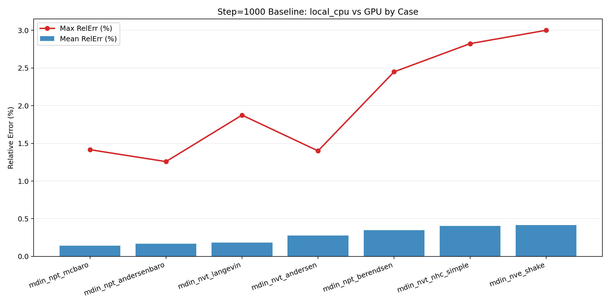
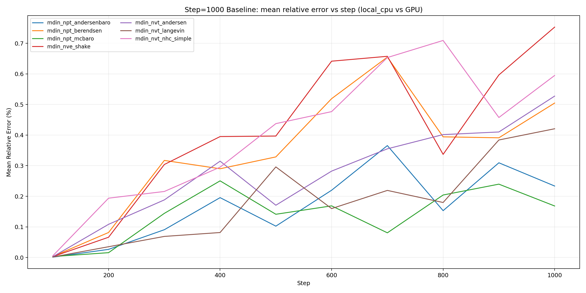
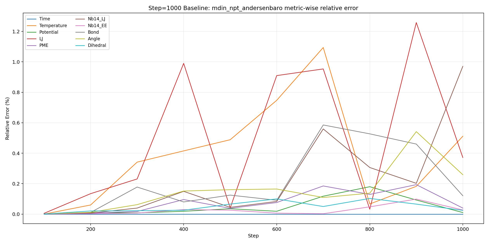

# CPU SPONGE (正式版)

## 背景
本仓库是 SPONGE 的 CPU 正式实现，目标是：

1. 在无 GPU 环境下可直接运行分子动力学流程。
2. 保持与 GPU 参考版本在关键物理量上的一致性。
3. 提供一套可复现的本地测试与误差分析流程。

仓库内已包含 `test.zip`，拿到仓库即可在本地直接执行测试用例。

## 设计思路
实现遵循 `precision-first` 原则：

1. 保留核心数值主路径，避免引入额外拟合分支影响物理一致性。
2. 运行时默认设置 `SPONGE_CPU_OMP_LAUNCH=0`，优先保证稳定与可重复。
3. 通过统一脚本按固定步点（默认每 100 步）与 GPU 输出逐项对比误差。

## 仓库结构

```text
.
├── Makefile.cpu                  # CPU 构建入口
├── run_cpu.sh                    # CPU 运行包装脚本（自动构建 + 安全默认）
├── test.zip                      # 7个官方测试case
├── covid-tip4p/                  # 输入数据
└── tools/
    ├── run_step1000_matrix.sh    # GPU/CPU 矩阵测试（支持 step=1000/5000）
    ├── summarize_step_errors.sh  # 误差与评分汇总
    ├── plot_step_relerr.py       # 多指标误差图
    ├── plot_step1000_baseline.py # 1000步基线结果出图
    ├── run_appendix_pressure_sampling.sh
    └── plot_appendix_pressure.py
```

## 环境要求

1. Linux + `g++` + `make`
2. `unzip` `awk` `sed` `timeout` `flock` `rsync`
3. 如需画图：`python3` + `numpy` + `pandas` + `matplotlib`
4. GPU 对照程序默认路径：`/your/path/SPONGE/SPONGE` (https://spongemm.cn/zh/下载/CudaSPONGE程序)

Python 依赖安装：

```bash
python3 -m pip install --user numpy pandas matplotlib
```

## 构建与单例运行

```bash
# 构建
make -f Makefile.cpu -j"$(nproc)" sponge_cpu_mainpath

# 运行单个mdin
./run_cpu.sh -mdin /absolute/path/to/mdin.txt
```

## 如何测试（含 GPU 对照）

### 1) 7 case 全量测试（step=1000）

```bash
OUT_DIR=reports/step1000 \
STEP_LIMIT=1000 \
WRITE_INFORMATION_INTERVAL=100 \
ERR_STEP_START=100 \
ERR_STEP_INTERVAL=100 \
ERR_STEP_END=1000 \
PARALLEL_BACKENDS=2 \
./tools/run_step1000_matrix.sh
```

### 2) 7 case 全量测试（step=5000）

```bash
OUT_DIR=reports/step5000 \
STEP_LIMIT=5000 \
WRITE_INFORMATION_INTERVAL=100 \
ERR_STEP_START=100 \
ERR_STEP_INTERVAL=100 \
ERR_STEP_END=5000 \
PARALLEL_BACKENDS=2 \
./tools/run_step1000_matrix.sh
```

说明：`step=5000` 的流程和脚本已就绪，可直接运行；当前仓库内已固化的是 `step=1000` 基线结果（见下文）。

### 3) 汇总评分

```bash
OUT_DIR=reports/step1000 ./tools/summarize_step_errors.sh
```

### 4) 误差图

```bash
python3 ./tools/plot_step_relerr.py \
  --out-dir reports/step1000 \
  --focus-case mdin_npt_andersenbaro \
  --focus-backend local_cpu
```

## 测试用例清单（`test.zip`）

1. `mdin_npt_andersenbaro`
2. `mdin_npt_berendsen`
3. `mdin_npt_mcbaro`
4. `mdin_nve_shake`
5. `mdin_nvt_andersen`
6. `mdin_nvt_langevin`
7. `mdin_nvt_nhc_simple`

## 已完成基线结果（step=1000）

比较指标列：
`Step,Time,Temperature,Potential,LJ,PME,Nb14_LJ,Nb14_EE,Bond,Angle,Dihedral`

汇总结果（local_cpu 相对 GPU）：

1. 7/7 case 跑通，无 non-finite。
2. 平均相对误差：`0.277071%`
3. 最大相对误差：`3.000605%`

按 case 的误差（`mean_rel_err_pct / max_rel_err_pct`）：

1. `mdin_npt_andersenbaro`: `0.169735 / 1.257991`
2. `mdin_npt_berendsen`: `0.348508 / 2.449253`
3. `mdin_npt_mcbaro`: `0.141537 / 1.416090`
4. `mdin_nve_shake`: `0.415059 / 3.000605`
5. `mdin_nvt_andersen`: `0.276093 / 1.400187`
6. `mdin_nvt_langevin`: `0.184596 / 1.874703`
7. `mdin_nvt_nhc_simple`: `0.403969 / 2.823445`

基线原始数据位于仓库内：
`reports/step1000_baseline/`

基线图（由 1000 步数据生成）：







如需重新生成这些图：

```bash
python3 ./tools/plot_step1000_baseline.py
```

## 附录风格压力轨迹采集与出图

### 1) 采集 GPU 重复运行压力轨迹（默认 10 次，5000 步）

```bash
GPU_RUNS=10 \
STEP_LIMIT=5000 \
WRITE_INFORMATION_INTERVAL=100 \
./tools/run_appendix_pressure_sampling.sh
```

### 2) 生成压力轨迹图和统计 CSV

```bash
python3 ./tools/plot_appendix_pressure.py \
  --appendix-dir reports/step5000_appendix \
  --matrix-dir reports/step5000 \
  --case-name mdin_npt_andersenbaro \
  --cpu-backend local_cpu
```

输出包括：

1. `reports/step5000_appendix/pressure/*.csv`
2. `reports/step5000_appendix/figures/*.png`

## 备注

1. 实测速度与误差会受 CPU 型号、线程数、编译器版本影响。
2. 若 GPU 程序不在默认路径，请设置 `GPU_BIN=/your/path/SPONGE`。
3. 建议在固定环境下重复测试，便于横向复现与回归追踪。
